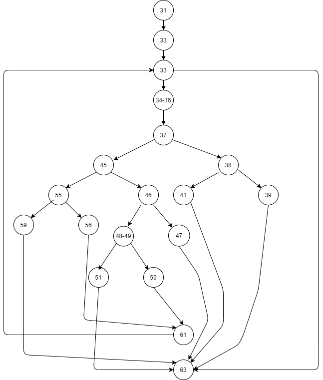

# SI_lab2_193136
# Втора лабораториска вежба по Софтверско инженерство

## Симеона Чичева, бр. на индекс 193136

###  Control Flow Graph

### Цикломатска комплексност

Цикломатската комплексност на овој код е 8, истата ја добив преку формулата P+1, каде што P е бројот на предикатни јазли. Во случајoв P=7, па цикломатската комплексност изнесува 8.

### Тест случаи според критериумот  Multiple Condition

statement:  
37 if (hr < 0 || hr > 24)

| Combination | Test time |
| ----------- | --------- |
| TF | Time(-5, 1, 1) |
| FT | Time(30, 1, 1) |
| FF | Time(10, 1, 1) |

statement:
46 if (min < 0 || min > 59)

| Combination | Test time |
| ----------- | --------- |
| TF | Time(1, -10, 1) |
| FT | Time(1, 60, 1) |
| FF | Time(1, 1, 1) |

statement:
49 if (sec >= 0 && sec <= 59)

| Combination | Test time |
| ----------- | --------- |
| TF | Time(1, 1, -10) |
| FT | Time(1, 1, 60) |
| FF | Time(1, 1, 1) |

statement:
55 if (hr == 24 && min == 0 && sec == 0)

| Combination | Test time |
| ----------- | --------- |
| TTT | Time(24, 0, 0) |
| TTF | Time(24, 0, 1) |
| TFT | Time(24, 1, 0) |
| TFF | Time(24, 1, 1) |

### Тест случаи според критериумот Every branch

.... 

### Објаснување на напишаните unit tests

...
...
